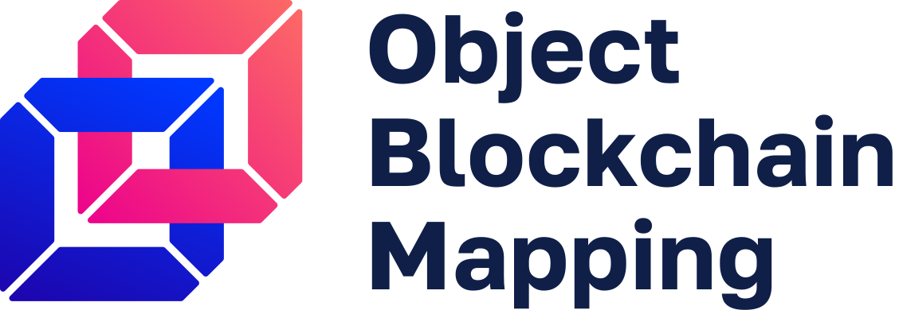

<p align="center">
    <br>
    <a href="https://github.com/madnesspie/obm">
        
    </a>
    <br>
    <br>
    <b>Async blockchain nodes interacting tool with ORM-like API</b>
    <br>
    <a href="https://obm.readthedocs.io/">
        Documentation
    </a>
    •
    <a href="https://github.com/madnesspie/obm/releases">
        Releases
    </a>
    <br>
    <br>
    <br>
    <br>
</p>

[](https://travis-ci.org/madnesspie/obm)
[](https://badge.fury.io/py/obm)
[](https://obm.readthedocs.io/en/latest/?badge=latest)
[](https://github.com/psf/black)

# Motivation
There are a lot of cryprocurrencies and many of them maintain their own
blockchain. Essentially, blockchain is a database, therefore you can interact
with it in the same way as with the ordinary database. If you follow how the
database interacting tools evolved, you can see that at low-level there are
database adapters (such as psycopg2, pymongo, etc.) on top of which are built
more abstract and convenient ORMs/ODMs (sqlalchemy, mongo-engine, etc.)
Blockchain technology, that is still in its infancy, really lacks similar tools
for developers. The goal of this project is to become such a tool. It provides
both low-level adapters and high-level ORM-like API for interacting with
blockchain node. Also, it's worth clarifying, that ordinary databases have
already reached stable APIs unlike blockchain nodes that just provide scattered
JSON RPC or/and other non-standard API. OBM is trying to do typically things in
universal way. Thereby standardization and unification become the second
project goal.


# Installation
```bash
pip install obm
```

# Requirements
- Python 3.8 or higher.
- (optional) [bitcoin-core](https://bitcoincore.org/en/download/) node
- (optional) [geth](https://geth.ethereum.org/downloads/) node

# Features
- Async and sync top-level ORM-like API
- BTC (bitcoin-core) and ETH (geth) support
- Implemented transaction fetching for Ethereum
- Unified API for sending/receiving transactions, addresses creation and fee
  estimating

## In future
- NodePool model for node horizontal scaling
- Support for: ETH, ETC, DASH, BCH, LTC, ZEC, XEM, XRP, etc.

# Example
It uses python built-in async REPL to show asynchronous API
features. Use to launch `python -m asyncio` (Python
3.8 or higher).
```python
>>> import asyncio
>>> from obm import models
>>> btc = models.Node(
...     name="bitcoin-core",
...     rpc_port=18332,
...     rpc_username="testnet_user",
...     rpc_password="testnet_pass",
... )
>>> eth = models.Node(
...     name="geth",
...     rpc_port=8545,
... )
>>> # Transaction fetching
>>> await btc.fetch_recent_transactions(limit=1)
[
    {
        "txid": "cc8c9f7a86261fcb00d68b62073c740b8a0e14079d67e44fd726e0de2954c69a",
        "from_address": "2NAmne8BsSXWbV5iStkVzL4vW7Z4F6a5o68",
        "to_address": "2NAmne8BsSXWbV5iStkVzL4vW7Z4F6a5o68",
        "amount": Decimal("0.00000866"),
        "fee": Decimal("0.00000134"),
        "block_number": 1722208,
        "category": "oneself",
        "timestamp": 1588076404,
        "info": {...},  # original content
    }
]
>>> await eth.fetch_recent_transactions(limit=1)
[
    {
        "txid": "0x4831820db0de1aad336c7a083b2504ad0b91eba293e5d7a6fa3bef49f660766c",
        "from_address": "0xe1082e71f1ced0efb0952edd23595e4f76840128",
        "to_address": "0xb610de1be67b10c746afec8fe74ad14d97e34146",
        "amount": Decimal("0.000029"),
        "fee": Decimal("0.000021"),
        "block_number": 6394779,
        "category": "oneself",
        "timestamp": None,
        "info": {...},  # original content
    }
]
>>> # Transaction sending
>>> await btc.send_transaction(
...     amount=0.00001,
...     to_address='2NAmne8BsSXWbV5iStkVzL4vW7Z4F6a5o68',
...     subtract_fee_from_amount=True,
... )
{
    "txid": "cc8c9f7a86261fcb00d68b62073c740b8a0e14079d67e44fd726e0de2954c69a",
    "from_address": "2NAmne8BsSXWbV5iStkVzL4vW7Z4F6a5o68",
    "to_address": "2NAmne8BsSXWbV5iStkVzL4vW7Z4F6a5o68",
    "amount": Decimal("0.00000866"),
    "fee": Decimal("0.00000134"),
    "block_number": None,
    "category": "oneself",
    "timestamp": 1588076404,
    "info": {...},
}
>>> await eth.send_transaction(
...     amount=0.00005,
...     from_address='0xe1082e71f1ced0efb0952edd23595e4f76840128',
...     to_address='0xb610de1be67b10c746afec8fe74ad14d97e34146',
...     subtract_fee_from_amount=True,
...     password="abc",
... )
{
    "txid": "0x4831820db0de1aad336c7a083b2504ad0b91eba293e5d7a6fa3bef49f660766c",
    "from_address": "0xe1082e71f1ced0efb0952edd23595e4f76840128",
    "to_address": "0xb610de1be67b10c746afec8fe74ad14d97e34146",
    "amount": Decimal("0.000029"),
    "fee": Decimal("0.000021"),
    "block_number": None,
    "category": "oneself",
    "timestamp": None,
    "info": {...},
}
```


# Is OBM production ready?
The project is now under active development and it haven't reached the stable
API yet. Use at your own risk and lock dependency version on minore.

# Contributing
See [CONTRIBUTING.rst](https://github.com/madnesspie/obm/blob/master/CONTRIBUTING.rst) for instructions.

Support the developer
=====================

# Sponsors
Special thanks for [Swapzilla](https://www.swapzilla.co/) project that
paid me part of the development.


You can also become the sponsor and get priority development of the features
you require. Just [contact me](https://github.com/madnesspie).

## Buy me a beer
```bash
BTC 179B1vJ8LvAQ2r9ABNhp6kDE2yQZfm1Ng3
```
