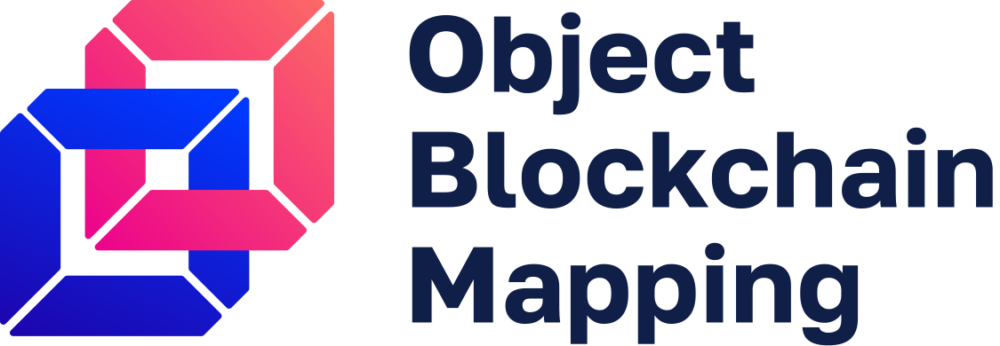

<p align="center">
    <br>
    <a href="https://github.com/madnesspie/obm">
        
    </a>
    <br>
    <br>
    <b>Async blockchain nodes interacting tool with ORM-like API</b>
    <br>
    <a href="https://obm.readthedocs.io/">
        Documentation
    </a>
    •
    <a href="https://github.com/madnesspie/obm/releases">
        Releases
    </a>
</p>


# Rationale
There are a lot of cryprocurrencies and many of them maintain their own blockchain. Essentially, blockchain is a database, therefore you can interact with it in the same way as with the ordinary database. If you follow how the database interacting tools evolved, you can see that at low-level there are database adapters (such as psycopg2, pymongo, etc.) on top of which are built
more abstract and convenient ORMs/ODMs (sqlalchemy, mongo-engine, etc.) Blockchain technology, that is still in its infancy, really lacks similar tools for developers. The goal of this project is to become such a tool. It provides both low-level adapters and high-level ORM-like API for interacting with blockchain node. Also, it's worth clarifying, that ordinary databases have already reached stable APIs unlike blockchain nodes that just provide scattered JSON RPC or/and other non-standard API. OBM is trying to do typically things in universal way. Thereby standardization and unification become the second project goal.


# Installation
```bash
pip install obm
```

# Requirements
- Python 3.8 or higher.
- (optional) [bitcoin-core](https://bitcoincore.org/en/download/) node
- (optional) [geth](https://geth.ethereum.org/downloads/) node

# Features
- BTC (bitcoin-core) and ETH (geth) support
- Implemented :bash:`list-transactions` for ETH
- Unified API for sending/receiving transactions, addresses creation and fee
  estimating

## In future
- support of: ETH, ETC, DASH, BCH, LTC, ZEC, XEM, XRP, etc.

# Is OMB production ready?
The project is now under active development. Use at your own risk and lock dependency version on minore.

# Contributing
See [CONTRIBUTING.md](https://github.com/madnesspie/obm/blob/master/CONTRIBUTING.md) for instructions.

Support the developer
=====================

# Sponsors
Special thanks for [Swapzilla](https://www.swapzilla.co/) project that
paid me part of the development.


You can also become the sponsor and get priority development of the features
you require. Just [contact me](https://github.com/madnesspie).

## Buy me a beer
```bash
BTC 179B1vJ8LvAQ2r9ABNhp6kDE2yQZfm1Ng3
```
