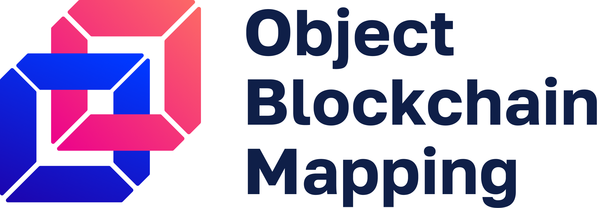

.. role:: bash(code)
   :language: bash

===========================================
Welcome to Object Blockchain Mapping!
===========================================

|travis| |pypi-version|

.. |pypi-version| image:: https://badge.fury.io/py/obm.svg
    :target: https://badge.fury.io/py/obm
    :alt: PyPI

.. |travis| image:: https://travis-ci.org/madnesspie/obm.svg?branch=master
    :target: https://travis-ci.org/madnesspie/obm
    :alt: travis

.. Rationale
.. =========
.. There are a lot of projects that need a cryptocurrency payment system under
.. the hood for transactions sending/receiving, unique addresses creation, fee
.. estimating and other blockchain interactions. Each of them have to implement
.. their own service for that propose due to lack of opensource product, that
.. could satisfy their needs. This project aims to provide such functionality and
.. facilitate the implementation of such a microservice.

.. Resources
.. =========

.. - Documentation: https://django-cryptocurrency-framework.readthedocs.io

Installation
============

.. code-block:: bash

    pip install obm

Requirements
============
- Python 3.8 or higher.
- (optional) `bitcoin-core <https://bitcoincore.org/en/download/>`_ node
- (optional) `geth <https://geth.ethereum.org/downloads/>`_ node

Features
========

- BTC (bitcoin-core) and ETH (geth) support
- Implemented :bash:`list-transactions` for ETH
- Unified API for sending/receiving transactions, addresses creation and fee
  estimating

Future features
---------------

- support of: ETH, ETC, DASH, BCH, LTC, ZEC, XEM, XRP, etc.

Is OMB production ready?
========================
The project is now under active development. Use at your own risk.

Contributing
============
See `CONTRIBUTING.md <https://github.com/madnesspie/obm/blob/master/CONTRIBUTING.md>`_ for instructions.

Support the developer
=====================

.. Sponsors
.. --------
.. Special thanks for `Swapzilla <https://www.swapzilla.co/>`_ project that
.. paid me part of the development.

.. .. figure:: https://raw.githubusercontent.com/madnesspie/django-cryptocurrency-framework/d285241038bb8d325599e8c4dddb567468daae81/docs/swapzilla.jpeg
..   :width: 100%
..   :figwidth: image
..   :alt: Swapzilla logo

.. You can also become the sponsor and get priority development of the features
.. you require. Just `contact me <https://github.com/madnesspie>`_.

Buy me a beer
-------------
.. code-block:: bash

    BTC 179B1vJ8LvAQ2r9ABNhp6kDE2yQZfm1Ng3
